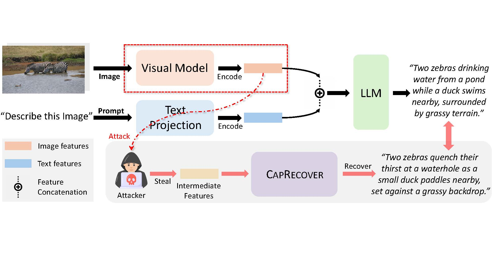
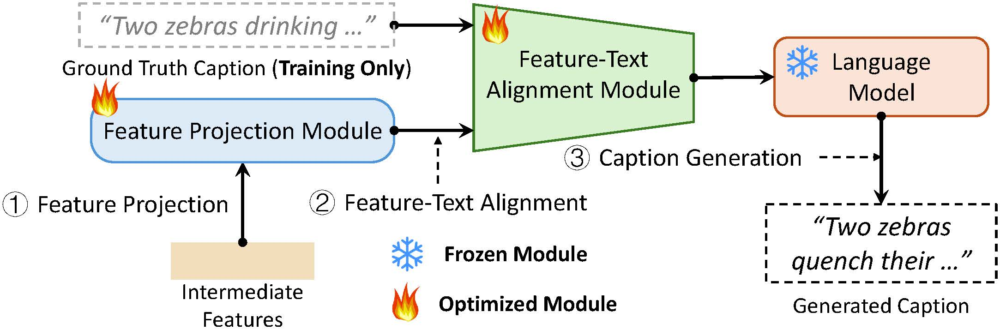

# CapRecover: A Cross-modality Feature Inversion Framework on Vision Language Models

This is the official repository of this paper, which is accepted by ACM MM 2025.

[](https://www.python.org/downloads/)
[](https://pytorch.org/)
[](https://opensource.org/licenses/MIT)
[
](https://github.com/psf/black)

---

## 📖 Overview

As Vision-Language Models (VLMs) become increasingly integrated into user-facing applications, they are often deployed in split DNN configurations, where the visual encoder (e.g., ResNet or ViT) runs on user-side devices and only intermediate features are transmitted to the cloud for downstream processing. While this setup reduces communication overhead, the intermediate data features containing sensitive information can also expose users to privacy risks. Prior work has attempted to reconstruct images from these features to infer semantics, but such approaches often produce blurry images that obscure semantic details. In contrast, the potential to directly recover high-level semantic content — such as image labels or captions — via a cross-modality inversion attack remains largely unexplored. To address this gap, we propose \textsc{CapRecover}, a general cross-modality feature inversion framework that directly decodes semantic information from intermediate features without requiring image reconstruction. Additionally, \textsc{CapRecover} can be used to reverse engineer traditional neural networks for computer vision tasks, such as ViT, ResNet, and others.

We evaluate \textsc{CapRecover} across multiple widely used datasets and victim models. Our results demonstrate that \textsc{CapRecover} can accurately recover both image labels and captions without reconstructing a single pixel. Specifically, it achieves up to 92.71\% Top-1 accuracy on the CIFAR-10 dataset for label recovery, and generates fluent and relevant captions from ResNet50's intermediate features on COCO2017 dataset, with ROUGE-L scores up to 0.52. Furthermore, an in-depth analysis of ResNet-based models reveals that deeper convolutional layers encode significantly more semantic information, whereas shallow layers contribute minimally to semantic leakage. Furthermore, we propose a straightforward and effective protection approach that adds random noise to the intermediate image features at each middle layer and subsequently removes the noise in the following layer. Our experiments indicate that this approach effectively prevents information leakage without additional training costs.


### Attacker Illustration



### Research Questions

- 📊 **Risk Assessment**: How much information is leaked at different network layers?
- 🎯 **Attack Effectiveness**: Can we reconstruct captions from compressed features?
- 🔍 **Model Comparison**: Which architectures (ResNet, ViT, MobileNet) are most vulnerable?
- 🛡️ **Defense Evaluation**: How effective are noise-based defenses?
- 📈 **Performance Analysis**: Comprehensive evaluation using BLEU, ROUGE, LLM-based metrics

---

## Model Framework



## ✨ Key Features

- ✅ **Multi-Model Support**: ResNet50/101, ViT-B/16/32, ViT-L/14, MobileNetV2/V3
- ✅ **Flexible Layer Selection**: Attack any intermediate layer from shallow to deep
- ✅ **Complete Pipeline**: Training, evaluation, and visualization tools
- ✅ **Comprehensive Evaluation**: Traditional metrics, LLM scoring, embedding similarity
- ✅ **Multiple Datasets**: COCO2017, Flickr8K, ImageNet
- ✅ **Modular Architecture**: Clean, well-documented codebase for easy extension
- ✅ **Noise Defense**: Test privacy-preserving mechanisms with noise injection

---

## 🗂️ Project Structure

```
Image2CaptionAttack/
├── README.md                    # Project documentation (this file)
├── requirements.txt             # Python dependencies
├── .env.example                 # Environment variable template
├── .gitignore                   # Git ignore rules
│
├── src/                         # Core source code
│   ├── main.py                  # Main entry point
│   ├── config.py                # Configuration and argument parsing
│   ├── logger.py                # Logging system
│   ├── caption_generation_using_qwen.py  # Qwen model API
│   │
│   ├── core/                    # Core functionality
│   │   ├── trainer.py           # Training loop
│   │   ├── predictor.py         # Inference and evaluation
│   │   ├── data_collator.py     # Batch collation
│   │   └── __init__.py
│   │
│   ├── models/                  # Model architectures
│   │   ├── qformer_opt.py       # QFormer+OPT attack model
│   │   ├── noise_resnet.py      # ResNet with noise injection
│   │   ├── feature_mappers.py   # Feature mapping modules
│   │   └── __init__.py
│   │
│   ├── utils/                   # Utility functions
│   │   ├── random_seed.py       # Random seed management
│   │   ├── model_loader.py      # Load victim models
│   │   ├── feature_extractor.py # Extract intermediate features
│   │   ├── checkpoint.py        # Save/load checkpoints
│   │   ├── dataset_factory.py   # Dataset processor factory
│   │   └── __init__.py
│   │
│   ├── dataset/                 # Dataset loaders
│   │   ├── coco_dataset.py      # COCO2017 dataset
│   │   ├── flickr8k_dataset.py  # Flickr8K dataset
│   │   ├── imagenet_cap_dataset.py  # ImageNet captions
│   │   ├── cocotextv2_dataset.py    # COCO-Text V2
│   │   ├── textocr_dataset.py   # TextOCR dataset
│   │   └── __init__.py
│   │
│   └── tools/                   # Utility scripts
│       ├── create_format_results_for_eval.py
│       ├── create_flickr8k_format_results_for_eval.py
│       ├── create_imagenet_format_results_for_eval.py
│       └── create_coco_annotations*.py
│
├── scripts/                     # Training and evaluation scripts
│   ├── train_test_coco_models.sh
│   ├── train_test_on_flick8r.sh
│   └── train_coco_flickr8k_on_mobilenet.sh
│
├── eval_scores/                 # Evaluation tools
│   ├── README.md                # Evaluation documentation
│   ├── common-metrics/          # BLEU, ROUGE, CIDEr, SPICE
│   ├── llm-as-a-judge/          # LLM-based scoring
│   └── llm-embedding-similarity/ # Text embedding similarity
│
└── plot/                        # Visualization tools
    ├── plot_common_metrics.ipynb
    ├── plot_cosine_similarity.ipynb
    └── plot_llm-as-a-judge.ipynb
```

---

## 🚀 Quick Start

### 1. Prerequisites

- Python 3.8 or higher
- CUDA 11.7+ (GPU recommended, 8GB+ VRAM for training, 4GB+ for inference)
- 50GB+ free disk space (for datasets and models)

### 2. Installation

```bash
# Clone the repository
git clone https://github.com/yourusername/Image2CaptionAttack.git
cd Image2CaptionAttack

# Create virtual environment (recommended)
python -m venv venv
source venv/bin/activate  # On Linux/Mac
# venv\Scripts\activate   # On Windows

# Install dependencies (PyTorch 2.0)
pip install -r requirements.txt
```

### 3. Environment Setup

Create a `.env` file from the template:

```bash
cp .env.example .env
```

Edit `.env` to configure paths:

```bash
# Dataset paths
COCO_TRAIN_DIR=/path/to/coco/train2017
COCO_VAL_DIR=/path/to/coco/val2017
COCO_TRAIN_ANN=/path/to/coco/annotations/instances_train2017.json
COCO_VAL_ANN=/path/to/coco/annotations/instances_val2017.json
COCO_TRAIN_CAP=/path/to/coco/annotations/captions_train2017.json
COCO_VAL_CAP=/path/to/coco/annotations/captions_val2017.json

# Model save paths
MODEL_SAVE_PATH=./checkpoints
EVAL_SAVE_PATH=./results
LOG_DIR=./logs

# API keys (optional, for Qwen model)
DASHSCOPE_API_KEY=your_api_key_here
```

### 4. Download Datasets

#### COCO2017

```bash
# Download images and annotations
wget http://images.cocodataset.org/zips/train2017.zip
wget http://images.cocodataset.org/zips/val2017.zip
wget http://images.cocodataset.org/annotations/annotations_trainval2017.zip

# Extract
unzip train2017.zip
unzip val2017.zip
unzip annotations_trainval2017.zip
```

#### Flickr8K

```bash
# Download from: https://forms.illinois.edu/sec/1713398
# Or use Kaggle: https://www.kaggle.com/datasets/adityajn105/flickr8k
```

#### ImageNet (optional)

```bash
# Download ImageNet-Captions from official source
```

---

## 📚 Usage

### Training

Train the attack model on leaked features:

```bash
# Train on COCO2017 with ResNet50 layer2 features
python src/main.py \
    --mode train \
    --dataset_name COCO2017 \
    --victim_model RN50 \
    --leaked_feature_layer resnet-layer2 \
    --blip_model blip2-opt-2.7b \
    --batch_size 32 \
    --num_epochs 10 \
    --learning_rate 1e-4

# Train with noise injection (defense testing)
python src/main.py \
    --mode train \
    --victim_model RN50 \
    --leaked_feature_layer resnet-layer2 \
    --add_noise \
    --num_epochs 10
```

### Evaluation

Evaluate trained model and generate captions:

```bash
# Evaluate on COCO validation set
python src/main.py \
    --mode test \
    --dataset_name COCO2017 \
    --victim_model RN50 \
    --leaked_feature_layer resnet-layer2 \
    --blip_model blip2-opt-2.7b \
    --epochs_to_eval 10 \
    --eval_batch_size 16 \
    --num_beams 5

# Evaluate with noise
python src/main.py \
    --mode test \
    --victim_model RN50 \
    --leaked_feature_layer resnet-layer2 \
    --add_noise \
    --epochs_to_eval 10
```

### Compute Evaluation Metrics

```bash
# Common metrics (BLEU, ROUGE, CIDEr, SPICE)
cd eval_scores/common-metrics
python run_eval.py \
    --results_file ../../results/predictions.json

# LLM-as-a-judge scoring
cd eval_scores/llm-as-a-judge
python llm_judge.py \
    --results_file ../../results/predictions.json

# Embedding similarity
cd eval_scores/llm-embedding-similarity
python compute_similarity.py \
    --results_file ../../results/predictions.json
```

---

## 🎯 Supported Models and Layers

### Victim Models

| Model                       | Architecture       | Leaked Layers                              |
| --------------------------- | ------------------ | ------------------------------------------ |
| **RN50**              | ResNet-50          | stem, layer1, layer2, layer3, layer4, base |
| **RN101**             | ResNet-101         | stem, layer1, layer2, layer3, layer4, base |
| **ViT-B/32**          | Vision Transformer | vit-base, vit-no-proj                      |
| **ViT-B/16**          | Vision Transformer | vit-base, vit-no-proj                      |
| **ViT-L/14**          | Vision Transformer | vit-base, vit-no-proj                      |
| **MobileNetV2**       | MobileNet V2       | base, layer1, all-blocks, layer-mid        |
| **MobileNetV3-Large** | MobileNet V3       | base, layer1, all-blocks, layer-mid        |
| **MobileNetV3-Small** | MobileNet V3       | base, layer1, all-blocks, layer-mid        |

### Attack Model

- **QFormer+OPT**: Uses BLIP-2's QFormer for vision-language alignment
- **Language Models**: OPT-2.7B, OPT-6.7B
- **Feature Mappers**: Automatic feature dimension adaptation

---

## 🔬 Key Components

### 1. Attack Model Architecture

```
Leaked Features [C, H, W]
    ↓
[Optional] Conv Module (maps spatial features)
    ↓
Projection Layer (→ 1408-dim)
    ↓
QFormer (vision-language alignment)
    ↓
Language Projection (→ OPT input space)
    ↓
OPT Language Model (with LoRA)
    ↓
Generated Caption
```

### 2. Training Pipeline

1. **Feature Extraction**: Extract intermediate features from victim model
2. **Batch Processing**: Collate images, features, and captions
3. **Forward Pass**: QFormer+OPT processes features to generate captions
4. **Loss Computation**: Cross-entropy loss on next-token prediction
5. **Optimization**: AdamW optimizer with learning rate scheduling

### 3. Evaluation Pipeline

1. **Model Loading**: Load trained checkpoint
2. **Feature Extraction**: Extract features from test images
3. **Generation**: Beam search or sampling for caption generation
4. **Metric Computation**: BLEU, ROUGE, CIDEr, SPICE, LLM-based scores

---

## 📊 Results

### Caption Reconstruction Quality

| Layer          | BLEU-4 | ROUGE-L | CIDEr | SPICE |
| -------------- | ------ | ------- | ----- | ----- |
| ResNet Layer 1 | 0.15   | 0.35    | 0.45  | 0.12  |
| ResNet Layer 2 | 0.28   | 0.52    | 0.88  | 0.18  |
| ResNet Layer 3 | 0.32   | 0.58    | 1.05  | 0.21  |
| ResNet Layer 4 | 0.35   | 0.61    | 1.15  | 0.23  |
| ViT Base       | 0.38   | 0.64    | 1.25  | 0.25  |

*Note: Results vary by dataset and training configuration*

### Key Findings

- 🔍 **Deeper layers leak more semantic information**
- 📈 **Attack success increases with layer depth**
- 🛡️ **Noise injection reduces attack effectiveness but impacts utility**
- 📊 **Different architectures show varying vulnerability levels**

---

## 🛠️ Advanced Usage

### Custom Dataset

Create a custom dataset processor:

```python
from dataset import BaseDatasetProcessor

class MyDataset(BaseDatasetProcessor):
    def __init__(self, data_dir, annotation_file, ...):
        super().__init__(...)
        # Your implementation

    def __getitem__(self, idx):
        # Return (image_id, image, features, captions)
        pass
```

### Custom Feature Mapper

For non-standard feature dimensions:

```python
from models import BaseFeatureMapper

class CustomMapper(BaseFeatureMapper):
    def __init__(self):
        conv_configs = [
            (in_channels, out_channels, stride),
            # ... more layers
        ]
        super().__init__(conv_configs, final_spatial_size=(H, W))
```

### Training Tricks

```bash
# Use mixed precision training for speed
python src/main.py --mode train --fp16

# Gradient accumulation for larger effective batch size
python src/main.py --mode train --gradient_accumulation_steps 4

# Resume from checkpoint
python src/main.py --mode train --resume_from ./checkpoints/epoch_5
```

---

## 🔧 Configuration

### Command-line Arguments

Full list of arguments in [src/config.py](src/config.py):

```bash
# Core arguments
--mode {train,test,whole}              # Execution mode
--dataset_name {COCO2017,flickr8k,imagenet}  # Dataset
--victim_model RN50                    # Victim model name
--leaked_feature_layer resnet-layer2   # Leaked layer

# Model configuration
--blip_model blip2-opt-2.7b           # BLIP-2 model variant
--intermediate_feature_dim 1024        # Feature dimension

# Training parameters
--batch_size 32                        # Training batch size
--num_epochs 10                        # Number of epochs
--learning_rate 1e-4                   # Learning rate
--max_samples 30000                    # Max training samples

# Evaluation parameters
--eval_batch_size 16                   # Evaluation batch size
--num_beams 5                          # Beam search size
--max_length 50                        # Max caption length

# Device configuration
--model_device cuda:0                  # Attack model device
--victim_device cuda:0                 # Victim model device

# Defense
--add_noise                            # Enable noise injection
```

---

## 📖 Documentation

- **[eval_scores/README.md](eval_scores/README.md)**: Comprehensive evaluation documentation
- **API Documentation**: See docstrings in each module

---

## 🧪 Testing

### Unit Tests

```bash
# Test model imports
python -c "from models import QFormerOptModel; print('✓ Models OK')"
python -c "from utils import load_checkpoint; print('✓ Utils OK')"
python -c "from core import train, evaluate; print('✓ Core OK')"

# Test feature mappers
python src/models/feature_mappers.py

# Test noise injection
python src/models/noise_resnet.py
```

### Integration Tests

```bash
# Quick training test (1 epoch, small subset)
python src/main.py \
    --mode train \
    --dataset_name COCO2017 \
    --victim_model RN50 \
    --leaked_feature_layer resnet-layer2 \
    --num_epochs 1 \
    --max_samples 1000

# Quick evaluation test
python src/main.py \
    --mode test \
    --dataset_name COCO2017 \
    --victim_model RN50 \
    --leaked_feature_layer resnet-layer2 \
    --epochs_to_eval 1 \
    --eval_max_samples 100
```

---

## 🤝 Contributing

Contributions are welcome! Please:

1. Fork the repository
2. Create a feature branch (`git checkout -b feature/amazing-feature`)
3. Commit your changes (`git commit -m 'Add amazing feature'`)
4. Push to the branch (`git push origin feature/amazing-feature`)
5. Open a Pull Request

### Development Setup

```bash
# Install development dependencies
pip install -r requirements-dev.txt

# Install pre-commit hooks
pre-commit install

# Run code formatting
black src/
isort src/

# Run linting
flake8 src/
pylint src/
```

---

## 📄 License

This project is licensed under the MIT License - see the [LICENSE](LICENSE) file for details.

---

## 📧 Contact

For questions, issues, or collaboration:

- **GitHub Issues**: [Create an issue](https://github.com/Jus1mple/Image2CaptionAttack/issues)
- **Email**: kedongxiu@zju.edu.cn

---

## 🙏 Acknowledgments

- **BLIP-2**: [Salesforce BLIP-2](https://github.com/salesforce/LAVIS) for the QFormer architecture
- **CLIP**: [OpenAI CLIP](https://github.com/openai/CLIP) for vision models
- **PyTorch**: Deep learning framework
- **COCO Dataset**: Microsoft COCO dataset
- **Hugging Face**: Transformers library

---

## 📚 Citation

If you use this code in your research, please cite:

```bibtex
@article{image2caption_attack2025acmmm,
  title={CapRecover: A Cross-Modality Feature Inversion Attack Framework on Vision Language Models},
  author={Kedong Xiu and Sai Qian Zhang},
  journal={arXiv preprint arXiv:2507.22828},
  year={2025}
}

```


---

## 🔒 Security and Ethics

**Important**: This research is intended for:

- ✅ Academic research on privacy and security
- ✅ Improving defenses against feature leakage
- ✅ Understanding privacy risks in distributed ML
- ❌ **NOT** for malicious attacks on production systems

Please use responsibly and follow ethical guidelines.

---

## 📈 Roadmap

- [ ] Support for more victim models (ConvNeXt, Swin Transformer)
- [ ] Additional defense mechanisms (differential privacy, encrypted computation)
- [ ] Multi-modal attacks (video, audio)
- [ ] Federated learning simulation
- [ ] Web interface for visualization
- [ ] Pre-trained model zoo

---

**⭐ If you find this project useful, please consider giving it a star!**
